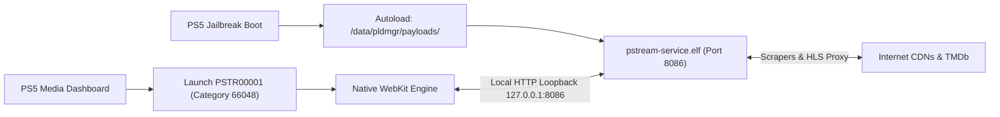

# PStream for PlayStation 5 — Official Installation & User Guide

<p align="center">
  
</p>

> **Zero PC Hardware Required. 100% Standalone Native Fullscreen Media App for Jailbroken PS5.**

---

## 📖 Table of Contents
1. [Overview & Highlights](#-overview--highlights)
2. [Prerequisites](#-prerequisites)
3. [Quick Start: One-Time Payload Installation](#-quick-start-one-time-payload-installation)
   - [Method A: Windows (PowerShell Script)](#method-a-windows-powershell)
   - [Method B: Linux / macOS / Android (Netcat / Terminal)](#method-b-linux--macos--android-netcat)
   - [Method C: GUI Payload Senders](#method-c-gui-payload-senders)
4. [Launching PStream on PS5](#-launching-pstream-on-ps5)
5. [DualSense Controller Mapping](#-dualsense-controller-mapping)
6. [Features Walkthrough](#-features-walkthrough)
7. [Architecture & How Standalone Mode Works](#-architecture--how-standalone-mode-works)
8. [Troubleshooting & FAQ](#-troubleshooting--faq)

---

## 🌟 Overview & Highlights

**PStream** is a native, standalone streaming media client designed exclusively for jailbroken PlayStation 5 consoles. It delivers a Netflix-class television experience powered directly by your PS5's hardware.

* **100% Standalone (Zero PC Required):** An ultra-efficient C daemon (`pstream-service.elf`) runs directly in the background of the PS5. You do **not** need a computer running on your network.
* **Native Fullscreen BigApp:** Registered under Sony's official media category (`applicationCategoryType: 66048`). It launches borderless in 1080p/4K directly from the PS5 Media dashboard—never in a browser card, web widget, or windowed frame.
* **Silky Smooth 60 FPS Viewport Scrolling:** Custom `requestAnimationFrame` easing engine built for PlayStation WebKit. Viewport auto-scrolls seamlessly with the cursor across episodes and recommendations.
* **Horizontal Seasons Carousel:** Easily browse series with dozens of seasons (Grey's Anatomy, The Simpsons, etc.) with automatic centering of active season pills.
* **DualSense Spatial TV Navigation:** Full controller support with D-pad, thumbstick, face buttons, shoulder triggers, and hotkeys.
* **Built-in HLS & AES-128 Decryption:** Instant sub-millisecond local proxy decryption and multi-provider stream scrapers.
* **In-Player Drawers & Audio:** Switch audio languages, subtitles, and episodes on the fly without stopping playback.
* **Persistent Auto-Load:** The daemon automatically starts on console boot through `/data/pldmgr/payloads/`.

---

## 📋 Prerequisites

Before installing PStream, make sure you have:
1. **A Jailbroken PlayStation 5:** All jailbroken firmwares (`3.00` through `13.60+`) supported.
2. **Internet Connection on PS5:** Ethernet or Wi-Fi connected to the internet (needed to stream video and TMDb metadata).
3. **Active ELF Loader on PS5:** Trigger your jailbreak (WebKit, BD-J, Lua, or IPv6) with payload loader listening on **port `9021`**, or use **Payload Manager** directly on-console.
4. **Any PC, Mac, or Phone on the Same Wi-Fi/LAN:** Used **only once** for 5 seconds to send the installer payload to your PS5.

---

## 🚀 Quick Start: Installation & Update Methods

Download your preferred package from the Releases tab:
* **`PStream-PayloadManager.zip`** ➔ **(Recommended — Zero PC):** For the on-console PS5 **Payload Manager** homebrew menu.
* **`PStream-PS5Upload.zip`** ➔ For sending over Wi-Fi/LAN via the **PS5Upload** app (Port 9021).
* **`PStream-PS5-v1.0.0.zip`** ➔ Complete bundle with both tools + offline installation guide.

---

### Method A: PS5 Payload Manager (100% Zero PC — Direct from Console)

If you have **Payload Manager** (or etaHEN) on your PS5:
1. Extract `PStream-PayloadManager.zip` and place `PStream-PayloadManager.elf` into `/data/pldmgr/payloads/` on your PS5 (via USB drive or FTP).
2. On your PS5, open the **Payload Manager** homebrew menu.
3. Select **`PStream-PayloadManager.elf`** and press **Cross (✕)**.
4. **Smart Auto-Detection:**
   - **First Time Running:** Automatically installs PStream, copies static assets to `/user/app/PSTR00001/`, registers the native fullscreen Media App tile (`PSTR00001`), configures background daemon autoload in `/data/pldmgr/autoload.txt`, and boots the daemon on port 8086.
   - **Already Installed:** Automatically connects to GitHub (`https://github.com/ducky-ux1/PStream`), checks if a newer version exists, and downloads/applies the update directly over your PS5's internet connection!

---

### Method B: PS5Upload App & GUI Payload Senders (Port 9021)

You can send the payload using **PS5Upload** (or any PS5 payload sender tool):
1. Make sure your jailbreak exploit is running and payload listener is active (default port `9021`).
2. Find your PS5's IP address:
   > On PS5: **Settings** ➔ **Network** ➔ **Connection Status** ➔ **View Connection Status** (e.g. `192.168.1.50`).
3. Open **PS5Upload** on your PC or phone:
   - Enter your **PS5 IP** (e.g. `192.168.1.50`).
   - Port: **`9021`**.
   - Select file: **`PStream-PS5Upload.elf`** (extracted from `PStream-PS5Upload.zip`).
   - Click **Send / Upload**.
4. The installer executes immediately on the console, deploying PStream and auto-configuring Payload Manager!

---

### Method C: Command Line (Windows PowerShell / Linux / macOS / Netcat)

**Windows PowerShell:**
```powershell
.\send_elf.ps1 -Ps5Host 192.168.1.50 -Elf .\PStream-PS5Upload.elf
```

**Linux / macOS / Android Terminal (Netcat):**
```bash
nc -w 3 192.168.1.50 9021 < PStream-PS5Upload.elf
```

---

### 🔄 In-App Automatic Updates (Direct from TV Couch)

Once PStream is installed, you don't even need to send payloads to update:
1. When an update is pushed to GitHub, PStream displays a sleek **"UPDATE AVAILABLE"** badge on boot.
2. Open **Settings** inside PStream and click **"Check for Updates"**.
3. If an update is found, click **"Install Update Now"**. The background C daemon (`pstream-service`) downloads the latest files from GitHub directly into `/user/app/PSTR00001/` and refreshes the app seamlessly without any PC!

---

## 🎮 Launching PStream on PS5

Once installation completes:
1. Navigate to your PS5 home screen.
2. Switch to the **Media** tab (top-left).
3. You will see **PStream** with its official custom icon (`icon0.png`) and title art.
4. Select **PStream** and press **Cross (X)**.
5. The splash screen (`pic1.png`) will display briefly, and the app will open directly into the cinematic Netflix-style home feed!

> [!TIP]
> **You can now completely shut down your PC!** PStream is 100% self-hosted on your PS5's internal SSD.

---

## 🕹️ DualSense Controller Mapping

| Button / Control | Browse Mode | Detail Modal Mode | Fullscreen Player |
| :--- | :--- | :--- | :--- |
| **D-Pad / Left Stick** | Grid & Shelf Navigation | Navigate Sections & Cards | OSD Navigation / Seek Scrub |
| **Cross (✕)** | Open Title / Select Tab | Play Media / Select Season / Select Card | Play / Pause / Activate Button |
| **Circle (◯)** | Clear Search / Exit Menu | Close Modal & Return to Browse | Exit Player & Return to Browse |
| **Square (▢)** | — | — | Toggle Aspect Ratio (Contain / Cover / Fill) |
| **Triangle (△)** | Jump to Search Tab | — | Quick Search |
| **L1 / R1** | Switch Catalog Tabs | — | — |
| **L2 / R2** | — | — | Jump 10s Backward / Forward |
| **Options (☰)** | Quick Menu | — | Open Audio, Subtitles & Episodes Drawer |

---

## 🎬 Features Walkthrough

### 1. Cinematic Home Feed & Shelves
* **Hero Billboard:** Automatically spotlights trending blockbusters with dynamic backdrops, synopsis, genre tags, and rating badges.
* **Top 10 Today:** Displays the 10 most popular movies and series formatted with high-contrast rank numbers.
* **Categorized Shelves:** Browse Action, Sci-Fi, Thrillers, Comedies, Dramas, and Japanese Anime with horizontal carousels.

### 2. Netflix-Style Metadata Modal
* **Follow-Focus Viewport Scrolling:** When scrolling down through long episode lists or recommendations, the modal viewport smoothly follows your focus at 60 FPS, keeping the active item vertically centered.
* **Horizontal Seasons Carousel:** Seamlessly navigate shows with dozens of seasons. Pressing D-Pad Right smoothly slides subsequent seasons into view.
* **"More Like This" Recommendations:** Traverse directly from the Play button down to recommended titles, complete with poster art, ratings, and instant modal switching.

### 3. Fullscreen Video Player
* **High-Bitrate HLS Streams:** Adaptive bitrate streaming with fast local proxy segment buffering.
* **In-Player Drawers:** Press **Options (☰)** during playback to slide out the episode selector or audio/subtitle language tracks without interrupting your movie.
* **Smart Resume:** PStream remembers your playback progress across reboots. Resume exactly where you left off from the "Continue Watching" row.

---

## ⚙️ Architecture & How Standalone Mode Works

Unlike traditional streaming solutions that require a Node.js or Python server running on your computer, PStream operates entirely within the PS5 operating system:



1. **Category `66048` (BigApp Media Container):** Defined in `param.json`, instructing the PS5 ShellCore to allocate dedicated BigApp resources and run full-screen without window decorations.
2. **Local HTTP Daemon (`pstream-service`):** Compiled with the Prospero PS5 toolchain. Handles local file serving from `/user/app/PSTR00001/`, HLS playlist rewriting, AES-128 key delivery, and TMDb metadata caching.
3. **Zero Configuration:** All networking runs locally over loopback (`127.0.0.1:8086`), requiring zero port forwarding or external dependencies.

---

## ❓ Troubleshooting & FAQ

### Q: The app displays "Something went wrong" or fails to open.
* **Cause:** The local daemon on port `8086` is not running.
* **Fix:** Make sure your jailbreak was triggered after booting the console. The daemon is placed in `/data/pldmgr/payloads/pstream-service.elf` to auto-start with the payload manager. If you rebooted without running your jailbreak, run your jailbreak exploit first.

### Q: Movies or episodes stall after a few seconds of playback.
* **Fix:** Open **Settings** within PStream and switch the stream provider from `English (Eng)` to `Multi-Language (Multi)` or vice versa. Ensure your PS5 has a stable internet connection.

### Q: Why isn't PStream showing up in a browser window or web widget?
* **Answer:** PStream is specifically compiled as a native PlayStation Media BigApp (`applicationCategoryType: 66048`). It was engineered so that it **never** runs as a browser card or widget.

### Q: How do I update PStream when a new version is released?
* **Answer:** You do not need to uninstall or re-jailbreak. Simply send the new `pstream-install.elf` payload to port `9021` while the console is on. The installer will cleanly overwrite the old app files in `/user/app/PSTR00001/` in under 3 seconds.

---

<p align="center">
  <b>PStream PS5</b> — Built with ❤️ for the PlayStation Homebrew Community.
</p>
