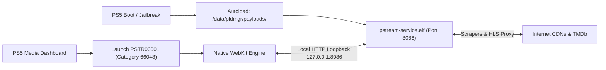

# PStream - PlayStation 5 Native Media App (v1.0.1 Standalone)

<p align="center">
  
</p>

<p align="center">
  <strong>An open-source, 100% free streaming application designed natively for PlayStation 5.</strong><br>
  100% Standalone console experience • Zero PC required • Dedicated C daemon on port 8086 • DualSense wireless controller engine • Zero ads.
</p>

<p align="center">
  <a href="https://ko-fi.com/duckyiux1"></a>
  
  
  
</p>

---

## 📖 Table of Contents
* [About The Project](#about-the-project)
* [Key Features](#key-features)
* [System Architecture](#system-architecture)
* [Installation Guide](#installation-guide)
* [DualSense Controller Mapping](#dualsense-controller-mapping)
* [Project Structure](#project-structure)
* [License](#license)

---

## About The Project

**PStream** is a free, open-source streaming app created specifically for the PlayStation community. It delivers a modern, high-fidelity TV interface directly to your PS5 dashboard, powered by native hardware video decoding, zero advertisements, and seamless DualSense navigation.

* **100% Standalone (Zero PC Required):** After sending the installer payload once to your PS5, no computer or external server is ever required. You can turn off your PC, pick up your DualSense controller, and stream movies and TV shows directly from your console.
* **100% Free & Always Free:** No subscriptions, no registration, no hidden paywalls, and **zero ads**.
* **Native Fullscreen Media Container:** Registered under official category `applicationCategoryType: 66048` (BigApp). Launches borderless in 1080p/4K directly from the PS5 Media dashboard—never in a browser card or web widget.
* **Silky Smooth 60 FPS Viewport Scrolling:** Custom `requestAnimationFrame` cubic-eased scroll engine built specifically for PlayStation WebKit. Auto-scrolls the modal viewport to keep active episodes and recommendations vertically centered.
* **Horizontal Seasons Carousel:** Seamlessly browse series with dozens of seasons (Grey's Anatomy, The Simpsons, etc.) with automatic centering of active season pills.
* **DualSense Controller Engine:** Tailored specifically for PlayStation DualSense controllers with edge-triggered button mappings, analog deadzones, and silky-smooth D-pad navigation.
* **Smart Continue Watching:** Remembers your exact episode and timestamp so you can resume your media with a single button press.

> [!NOTE]  
> If you enjoy PStream and want to support continued development, new providers, and upcoming PlayStation homebrew projects, you can support on Ko-fi:  
> **[https://ko-fi.com/duckyiux1](https://ko-fi.com/duckyiux1)** — Thank you for your support!

---

## System Architecture

Unlike traditional streaming solutions that require a Node.js or Python server running on your computer, PStream operates entirely within the PS5 operating system:



1. **Category `66048` (BigApp Media Container):** Defined in `param.json`, instructing the PS5 ShellCore to allocate dedicated BigApp resources and run full-screen without window decorations.
2. **Local HTTP Daemon (`pstream-service`):** Compiled with the Prospero PS5 toolchain. Handles local file serving from `/user/app/PSTR00001/`, HLS playlist rewriting, AES-128 key delivery, and TMDb metadata caching.
3. **Zero Configuration:** All networking runs locally over loopback (`127.0.0.1:8086`), requiring zero port forwarding or external dependencies.

---

## Installation Guide

For complete, detailed instructions on installing and updating PStream across Windows, Linux, macOS, and Android, check the dedicated guide:

👉 **[INSTALLATION_GUIDE.md](INSTALLATION_GUIDE.md)**

### Quick Start Options:
* **Option 1: PS5 Payload Manager (100% Zero PC):** Place `PStream-Installer.elf` in `/data/pldmgr/payloads/` and run it directly from your PS5's Payload Manager menu. Automatically installs the app and auto-updates from GitHub when already installed!
* **Option 2: PS5Upload & GUI Senders:** Send `pstream-install.elf` to your PS5's IP address on port `9021`.
* **Option 3: PowerShell Script (Windows):** Run `.\send_elf.ps1 -Ps5Host YOUR_PS5_IP -Elf .\pstream-install.elf`
* **Option 4: In-App Updates:** Update directly from your TV couch in PStream Settings with zero PC involved!

---

## DualSense Controller Mapping

| Button / Control | Browse Mode | Detail Modal Mode | Fullscreen Player |
| :--- | :--- | :--- | :--- |
| **D-Pad / Left Stick** | Grid & Shelf Navigation | Navigate Sections & Cards | OSD Navigation / Seek Scrub |
| **Cross (✕)** | Open Title / Select Tab | Play Media / Select Season / Select Card | Play / Pause / Activate Button |
| **Circle (◯)** | Clear Search / Exit Menu | Close Modal & Return to Browse | Exit Player & Return to Browse |
| **Square (▢)** | — | — | Toggle Aspect Ratio (Contain / Cover / Fill) |
| **Triangle (△)** | Jump to Search Tab | — | Quick Search |
| **L1 / R1** | Switch Catalog Tabs | — | — |
| **L2 / R2** | — | — | Jump 10s Backward / Forward |
| **Options (☰)** | Quick Menu | — | Open Audio, Subtitles & Episodes Drawer |

---

## Project Structure

```text
github/
├── .gitignore
├── LICENSE
├── README.md                      # Main repository documentation
├── INSTALLATION_GUIDE.md          # Comprehensive step-by-step setup guide
├── release/
│   ├── pstream-install.elf        # Standalone installer payload binary (~1.5 MB)
│   ├── PStream-PS5-v1.0.0.zip     # Packaged release archive with QuickStart guide
│   └── README.txt                 # Plaintext quick reference
└── ps5/
    ├── installer/
    │   ├── main.c                 # Installer source (AppInstUtil, assets INCBIN, daemon deploy)
    │   ├── Makefile               # Prospero clang build script
    │   ├── pstream-install.elf    # Compiled installer binary
    │   └── sce_sys/
    │       ├── param.json         # Media App definition (Category 66048, 0 deeplink)
    │       ├── icon0.png          # Dashboard icon (512x512)
    │       └── pic1.png           # Splash screen (1920x1080)
    ├── scripts/
    │   ├── pstream-service.c      # Standalone C daemon source (HLS proxy, AES-128 key relay)
    │   ├── pstream-service.elf    # Compiled standalone C daemon binary
    │   └── send_elf.ps1           # Windows PowerShell payload sender script
    └── www/
        ├── index.html             # PS5 WebKit Netflix-style TV UI
        ├── app.js                 # Spatial focus engine, modal navigation, TMDb API
        ├── app.css                # 60 FPS TV styles, focus highlights, modal sheet
        ├── input.js               # DualSense gamepad & keyboard input engine
        ├── hls.min.js             # Hardware-accelerated HLS video engine
        ├── logo.png               # Brand logo
        └── favicon.png            # Icon asset
```

---

## License

This project is licensed under the **GNU General Public License v3.0** (GPL-3.0). See [LICENSE](LICENSE) for details.
